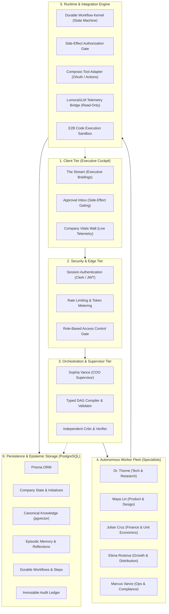
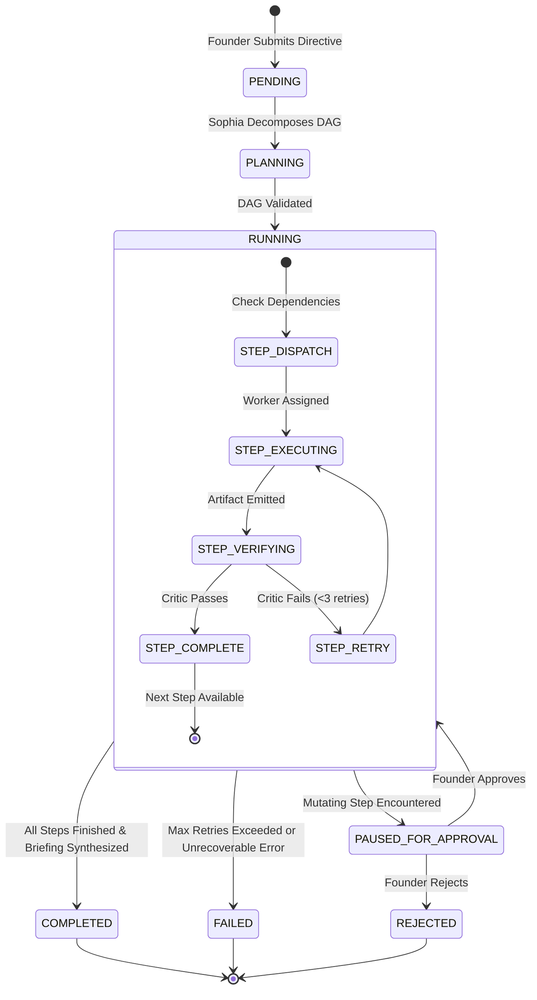
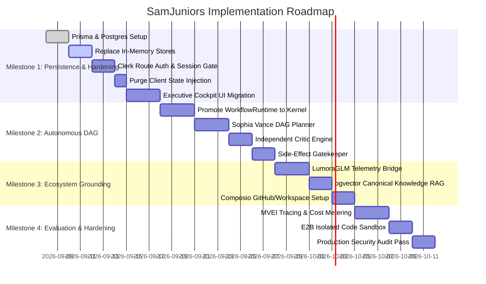

# SAMJUNIORS PRODUCT ARCHITECTURE SPECIFICATION
**Version:** 1.0.0-PROD  
**Status:** Approved Architectural Blueprint  
**Reference Audits:** AUDIT 00 through AUDIT 11  
**Target Systems:** `SamjuniorsOS`, `Lumoraglm`, `samjuniors_website`

---

## 1. Executive Summary & Core Mission

**SamJuniors** is an AI-native Company Operating System and Executive Cockpit designed for founders and leadership teams. It enables a founder to express strategic objectives, evaluate operational reality, and direct a specialized fleet of autonomous AI employees.

### The Core Mandate
Unlike toy multi-agent chat interfaces, roleplaying window managers, or unconstrained peer-to-peer swarms, SamJuniors operates on a fundamental principle:
> **The Founder directs objectives and reviews synthesized outcomes, decisions, risks, and approvals. The system plans, decomposes, executes, verifies, and audits work deterministically.**

```
┌─────────────────────────────────────────────────────────────────────────────┐
│                             FOUNDER OBJECTIVE                               │
└──────────────────────────────────────┬──────────────────────────────────────┘
                                       │ (High-level directive via Cockpit)
                                       ▼
┌─────────────────────────────────────────────────────────────────────────────┐
│                    SOPHIA VANCE (CHIEF OF STAFF / COO)                      │
│                  Deterministic Typed DAG Planning Engine                    │
└──────┬───────────────────────────────┬───────────────────────────────┬──────┘
       │ Task 1                        │ Task 2                        │ Task 3
       ▼                               ▼                               ▼
┌──────────────┐               ┌──────────────┐               ┌──────────────┐
│  DR. THORNE  │               │   MAYA LIN   │               │ JULIAN CRUZ  │
│  Technical & │               │   Product &  │               │ Financial &  │
│   Research   │               │ Specification│               │  Economics   │
└──────┬───────┘               └──────┬───────┘               └──────┬───────┘
       │ Artifact                     │ Artifact                     │ Artifact
       └───────────────────────┬──────┴──────────────────────────────┘
                               ▼
┌─────────────────────────────────────────────────────────────────────────────┐
│                    INDEPENDENT CRITIC / VERIFICATION                        │
│               Schema Validation, Reality Check, Unit Tests                  │
└──────────────────────────────────────┬──────────────────────────────────────┘
                                       ▼
┌─────────────────────────────────────────────────────────────────────────────┐
│                     SIDE-EFFECT AUTHORIZATION GATE                          │
│               Founder Review for Mutating External Actions                  │
└──────────────────────────────────────┬──────────────────────────────────────┘
                                       │ Approved
                                       ▼
┌─────────────────────────────────────────────────────────────────────────────┐
│               EXTERNAL ACTION & IMMUTABLE BLACKBOARD UPDATE                 │
│         GitHub / Google / Slack via Composio + PostgreSQL Storage           │
└─────────────────────────────────────────────────────────────────────────────┘
```

---

## 2. Architectural Principles & Golden Invariants

### 2.1 The Five Golden Governance Invariants
1. **Durability Invariant:** No state, workflow, memory, approval, or execution record may exist solely in ephemeral Node.js process memory. Every mutation must commit to PostgreSQL before external side effects are dispatched.
2. **Authentication & Session Invariant:** Every incoming request to any API endpoint or server action must validate a cryptographically verified Founder session token. Zero client-supplied identity parameters (`decidedBy: 'founder'`) are trusted.
3. **Blackboard Authority Invariant:** Client browsers and frontend runtimes are read-only display projections. The client cannot inject, merge, or overwrite company state, vitals, initiatives, or context snapshots (`clientSnapshot` injection is strictly prohibited).
4. **Side-Effect Isolation Invariant:** Pure reasoning and internal document drafting may run autonomously. Any action that mutates an external system (sending an email, creating a pull request, modifying production data, spending funds) is intercepted by the Side-Effect Authorization Gate and paused until cryptographic Founder approval.
5. **Epistemic Hygiene Invariant:** Structured state, canonical knowledge, and episodic memory are strictly partitioned. Unverified model outputs or conversational transcripts can never directly overwrite canonical ground truth without verification.

---

## 3. System Architecture Topology

The SamJuniors architecture is structured into six strictly separated tiers:



---

## 4. AI Workforce Model: Hierarchical DAG Execution

### 4.1 Rejection of the Peer-to-Peer "Swarm"
As proven in **AUDIT 02**, unconstrained peer-to-peer agent meshes produce quadratic token inflation ($O(N^2)$), conversational drift, mutual hallucination loops, and lack deterministic accountability. 

SamJuniors implements a **Hierarchical Supervisor with Typed DAG Decomposition and an Immutable Shared Blackboard**:

| Dimension | Peer-to-Peer Swarm (Rejected) | SamJuniors Hierarchical DAG (Adopted) |
|---|---|---|
| **Coordination** | Ad-hoc agent-to-agent chatter | Centralized Supervisor (Sophia Vance) |
| **Execution Plan** | Emergent / non-deterministic | Strongly-typed directed acyclic graph (DAG) |
| **Data Sharing** | Conversational context forwarding | Structured PostgreSQL Blackboard |
| **Token Cost** | Unbounded exponential growth | Linear and predictable bounded cost |
| **Accountability** | Undefined collective failure | Clear per-step attribution and logs |
| **Side Effects** | Any agent can trigger tools | Intercepted by the Gatekeeper before execution |

### 4.2 The Executive Roster & Roles
Each AI employee is an autonomous specialist operating with tailored prompt contracts, domain tools, and strict evaluation rubrics:

1. **Sophia Vance (Chief of Staff / COO)**
   - *Primary Job:* Translates founder directives into structured DAG workflows. Assigns steps, verifies intermediate artifacts, synthesizes final executive briefings, and flags blockers.
   - *Tool Access:* Workflow decomposition, artifact synthesizer, calendar inspector, task manager.
2. **Dr. Arthur Thorne (VP of Research & Technical Strategy)**
   - *Primary Job:* Architecture recon, code auditing, technical feasibility analysis, system design reviews, security vulnerability scanning.
   - *Tool Access:* GitHub API, file system analyzer, sandbox test runner, web documentation retriever.
3. **Maya Lin (Head of Product & UX)**
   - *Primary Job:* PRD authoring, user journey definition, feature prioritization, UX critique, acceptance criteria formulation.
   - *Tool Access:* PRD generator, competitive tear-down engine, design system auditor.
4. **Julian Cruz (Head of Finance & Unit Economics)**
   - *Primary Job:* Pricing model analysis, gross margin stress-testing, token infrastructure cost projection, runway calculation, financial risk audits.
   - *Tool Access:* Financial model spreadsheet generator, Stripe/revenue analytics bridge, unit economics calculator.
5. **Elena Rostova (Head of Growth & Communications)**
   - *Primary Job:* GTM strategy, value proposition drafting, customer onboarding flow optimization, developer documentation review.
   - *Tool Access:* SEO auditor, messaging tester, content formatter.
6. **Marcus Vance (Head of Legal, Operations & Compliance)**
   - *Primary Job:* Terms of service analysis, data privacy (GDPR/SOC2) compliance, SLA tracking, vendor risk assessment.
   - *Tool Access:* Compliance checklist runner, policy auditor.

---

## 5. Epistemic Architecture: State, Knowledge, Memory & Context

SamJuniors resolves the critical context pollution problem identified in **AUDIT 05** by maintaining an absolute four-layer epistemic boundary:

```
┌─────────────────────────────────────────────────────────────────────────────┐
│ 1. WORKING CONTEXT (Transient / In-Flight Context Window)                   │
│    - Active turn messages, tool call traces, immediate prompt scratchpad    │
│    - Lifetime: Single step or subagent run (Discarded upon completion)      │
├─────────────────────────────────────────────────────────────────────────────┤
│ 2. EPISODIC MEMORY (Historical Summaries & Past Decisions)                  │
│    - Structured summaries of past workflow outcomes and founder feedback    │
│    - Immutable log in PostgreSQL with confidence & decay scoring            │
│    - Dynamically retrieved via vector similarity and recency filter         │
├─────────────────────────────────────────────────────────────────────────────┤
│ 3. CANONICAL KNOWLEDGE (Authoritative Truth & System Specifications)        │
│    - Verified PRDs, architecture specifications, API contracts, brand rules │
│    - Embeddings stored in pgvector with strict source provenance (SHA-256)  │
│    - Cannot be modified without explicit Founder / Supervisor sign-off      │
├─────────────────────────────────────────────────────────────────────────────┤
│ 4. STRUCTURED COMPANY STATE (Deterministic Ground Truth)                    │
│    - Relational tables: metrics, headcount, active initiatives, cash balance│
│    - Direct SQL querying (Zero hallucination potential)                    │
│    - Always injected deterministically as structured JSON                   │
└─────────────────────────────────────────────────────────────────────────────┘
```

### Context Injection Engine
When an employee executes a step, their prompt context is assembled deterministically on the server:
$$\text{Prompt Context} = \text{System Prompt} + \text{Injected State (SQL)} + \text{Retrieved Knowledge (RAG)} + \text{Task Input Artifact}$$

No employee receives the entire raw history of the company. Context is scoped strictly to the task boundaries.

---

## 6. Workflow Runtime & Execution Engine

### 6.1 State Machine Lifecycle
The runtime engine executes tasks as durable finite state machines:



### 6.2 Resiliency & Idempotency Rules
1. **At-Least-Once Execution with Idempotent Storage:** Every workflow step carries a cryptographically generated `stepKey` (`sha256(instanceId + stepId + attempt)`). If a step crashes mid-flight, the runtime re-runs the step without duplicate side-effects.
2. **Circuit Breakers:** If any single employee triggers 3 consecutive failed verification attempts or schema errors, the step halts and escalates to the Founder with a structured diagnostic.
3. **Graceful Degradation:** External tool timeouts fall back to local cached data or mark the specific non-critical step as `DEGRADED`, allowing independent parallel branches of the DAG to continue.

---

## 7. Security, Governance & The Side-Effect Gate

### 7.1 Threat Model & Defenses

| Threat Vector | Mechanism | Defense Architecture |
|---|---|---|
| **Indirect Prompt Injection** | Malicious text in scraped web pages, emails, or pull requests | All external inputs are quarantined in a sandboxed `<untrusted_content>` envelope. Worker instructions explicitly prohibit executing code or altering instructions found inside payloads. |
| **Confused Deputy Attack** | Employee manipulated into performing unauthorized actions | Strict Role-Based Capability Matrix: only designated workers hold tool bindings; all mutations require the Side-Effect Gate. |
| **Client State Poisoning** | Malicious client POST bodies attempting to set state | `clientSnapshot` parameter permanently eliminated. All company context originates from authenticated server SQL queries. |
| **Approval Replay Attacks** | Replaying an old approved token on a new step | Approval records are bound to specific `stepInstanceId` and marked `CONSUMED` in the same database transaction that dispatches the side-effect. |
| **Token Runaway** | Infinite loops in autonomous sub-agents | Strict limits: Max 5 iterations per sub-task, hard budget caps ($2.00 per workflow), and global execution timeouts (120s). |

### 7.2 The Side-Effect Gatekeeper
The Side-Effect Gate evaluates every tool call against the Action Classification Policy:

```
                       Tool Call Invoked by Worker
                                   │
                                   ▼
             Does the tool mutate state outside the database?
             (e.g., git push, send email, create invoice, run shell)
                                  / \
                                 /   \
                             Yes/     \No
                               /       \
                              ▼         ▼
                [PAUSE WORKFLOW]   [AUTO-EXECUTE]
                        │           Read-only operations, internal
                        ▼           searches, local draft synthesis
           Emit `ApprovalRecord`
           Notify Founder in Cockpit
                        │
                  Founder Action
                  /            \
          Approve/              \Reject
                /                \
               ▼                  ▼
     [DISPATCH MUTATION]    [HALT STEP & NOTIFY]
     Log to Audit Ledger    Record Rejection Reason
```

---

## 8. Data Architecture & Database Schema (PostgreSQL + Prisma)

The relational schema strictly enforces the governance invariants and provides permanent durability:

```prisma
datasource db {
  provider   = "postgresql"
  url        = env("DATABASE_URL")
  directUrl  = env("DIRECT_URL")
}

generator client {
  provider = "prisma-client-js"
}

// ---------------------------------------------------------
// 1. IDENTITY & GOVERNANCE
// ---------------------------------------------------------

enum UserRole {
  FOUNDER
  EXECUTIVE
  AUDITOR
}

model User {
  id            String         @id @default(uuid())
  email         String         @unique
  name          String
  role          UserRole       @default(FOUNDER)
  createdAt     DateTime       @default(now())
  updatedAt     DateTime       @updatedAt
  approvals     ApprovalRecord[]
  initiatedRuns WorkflowInstance[]

  @@map("users")
}

// ---------------------------------------------------------
// 2. COMPANY OPERATIONAL STATE
// ---------------------------------------------------------

model CompanyState {
  id              String   @id @default(uuid())
  organizationId  String   @unique @default("default")
  name            String
  stage           String   // e.g., "Pre-Seed", "Series A"
  burnRateMonthly Decimal  @db.Decimal(12, 2)
  cashBalance     Decimal  @db.Decimal(12, 2)
  runwayMonths    Int
  activeEmployees Json     // Structured employee registry & status
  initiatives     Json     // Active strategic bets & progress
  updatedAt       DateTime @updatedAt

  @@map("company_state")
}

// ---------------------------------------------------------
// 3. CANONICAL KNOWLEDGE (RAG & SPECS)
// ---------------------------------------------------------

model CompanyKnowledge {
  id          String   @id @default(uuid())
  category    String   // "PRD", "ARCHITECTURE", "SOP", "BRAND"
  title       String
  content     String   @db.Text
  hash        String   @unique // SHA-256 for change detection
  metadata    Json     // Author, tags, version, verified status
  createdAt   DateTime @default(now())
  updatedAt   DateTime @updatedAt

  @@index([category])
  @@map("company_knowledge")
}

// ---------------------------------------------------------
// 4. EPISODIC MEMORY
// ---------------------------------------------------------

enum MemoryType {
  DECISION_OUTCOME
  FOUNDER_PREFERENCE
  OPERATIONAL_INCIDENT
  STRATEGIC_PIVOT
}

model CompanyMemory {
  id          String     @id @default(uuid())
  type        MemoryType
  summary     String     @db.Text
  details     Json       // Context, evidence, affected systems
  importance  Int        @default(1) // 1 to 5 scale
  decayScore  Float      @default(1.0)
  createdAt   DateTime   @default(now())

  @@index([type, createdAt])
  @@map("company_memories")
}

// ---------------------------------------------------------
// 5. DURABLE WORKFLOWS & DAG RUNTIME
// ---------------------------------------------------------

enum WorkflowStatus {
  PENDING
  RUNNING
  PAUSED_FOR_APPROVAL
  COMPLETED
  FAILED
  REJECTED
}

model WorkflowInstance {
  id           String           @id @default(uuid())
  title        String
  directive    String           @db.Text
  status       WorkflowStatus   @default(PENDING)
  totalCostUsd Decimal          @default(0.0) @db.Decimal(6, 4)
  dagTopology  Json             // Nodes, dependencies, edges
  resultData   Json?            // Final executive outcome
  initiatedById String
  initiatedBy  User             @relation(fields: [initiatedById], references: [id])
  steps        WorkflowStep[]
  createdAt    DateTime         @default(now())
  updatedAt    DateTime         @updatedAt

  @@map("workflow_instances")
}

enum StepStatus {
  PENDING
  READY
  RUNNING
  PAUSED_APPROVAL
  COMPLETED
  FAILED
  SKIPPED
}

model WorkflowStep {
  id             String           @id @default(uuid())
  workflowId     String
  workflow       WorkflowInstance @relation(fields: [workflowId], references: [id], onDelete: Cascade)
  stepKey        String           // Unique step identifier within the DAG
  employeeRole   String           // "Dr. Thorne", "Maya Lin", etc.
  title          String
  status         StepStatus       @default(PENDING)
  inputPayload   Json
  outputArtifact Json?
  errorMessage   String?
  retryCount     Int              @default(0)
  startedAt      DateTime?
  completedAt    DateTime?
  approvals      ApprovalRecord[]
  sideEffects    SideEffectAudit[]

  @@unique([workflowId, stepKey])
  @@map("workflow_steps")
}

// ---------------------------------------------------------
// 6. GOVERNANCE, APPROVALS & AUDIT LOGS
// ---------------------------------------------------------

enum ApprovalStatus {
  PENDING
  APPROVED
  REJECTED
  EXPIRED
}

enum RiskTier {
  LOW
  MEDIUM
  HIGH
  CRITICAL
}

model ApprovalRecord {
  id           String         @id @default(uuid())
  stepId       String
  step         WorkflowStep   @relation(fields: [stepId], references: [id], onDelete: Cascade)
  actionType   String         // e.g., "DEPLOY_CODE", "SEND_EMAIL", "DISBURSE_FUNDS"
  riskLevel    RiskTier       @default(HIGH)
  description  String         @db.Text
  payload      Json           // The exact payload to be dispatched
  status       ApprovalStatus @default(PENDING)
  decisionNote String?
  decidedById  String?
  decidedBy    User?          @relation(fields: [decidedById], references: [id])
  decidedAt    DateTime?
  createdAt    DateTime       @default(now())

  @@index([status])
  @@map("approval_records")
}

model SideEffectAudit {
  id             String       @id @default(uuid())
  stepId         String
  step           WorkflowStep @relation(fields: [stepId], references: [id])
  integration    String       // "GITHUB", "RESEND", "SLACK", "STRIPE"
  action         String
  requestPayload Json
  responseStatus Int
  responseBody   Json?
  executedAt     DateTime     @default(now())

  @@index([integration, executedAt])
  @@map("side_effect_audits")
}

// ---------------------------------------------------------
// 7. REALITY GROUNDING TELEMETRY (LUMORAGLM BRIDGE)
// ---------------------------------------------------------

model TelemetryMetric {
  id         String   @id @default(uuid())
  source     String   // "LUMORAGLM_PROD", "STRIPE_PROD"
  metricKey  String   // "active_students", "monthly_revenue", "system_errors"
  value      Decimal  @db.Decimal(14, 4)
  metadata   Json?
  recordedAt DateTime @default(now())

  @@index([source, metricKey, recordedAt])
  @@map("telemetry_metrics")
}
```

---

## 9. Integration & Telemetry Architecture

### 9.1 The Integration Strategy: Zero Commodity Re-invention
In alignment with **AUDIT 08**, SamJuniors does not rebuild standard business tools. It interfaces through standard infrastructure:

```
┌─────────────────────────────────────────────────────────────────────────────┐
│                          SAMJUNIORS CORE RUNTIME                            │
└──────┬───────────────────────────────┬───────────────────────────────┬──────┘
       │                               │                               │
       ▼                               ▼                               ▼
┌──────────────┐               ┌──────────────┐               ┌──────────────┐
│ DIRECT APIS  │               │   COMPOSIO   │               │ LUMORAGLM    │
│ Core Infra   │               │ Integrations │               │ Telemetry    │
├──────────────┤               ├──────────────┤               ├──────────────┤
│ - Clerk Auth │               │ - GitHub PRs │               │ - Live Users │
│ - PostgreSQL │               │ - Google Cal │               │ - Course KPI │
│ - Resend SES │               │ - Slack Bot  │               │ - Error Logs │
│ - Stripe Sub │               │ - Linear App │               │ (Read-Only)  │
└──────────────┘               └──────────────┘               └──────────────┘
```

### 9.2 The LumoraGLM Live Telemetry Bridge
To ground the AI workforce in empirical reality rather than synthetic assumptions:
- A secure, read-only database connection pool queries the live `Lumoraglm` database.
- Runs an asynchronous telemetry cron (`0 * * * *`) that records real student signups, lesson completions, and operational errors into `TelemetryMetric`.
- Dr. Thorne and Julian Cruz access real conversion rates and system health during planning.

---

## 10. Evaluation & Continuous Learning Engine (MVEI)

Adopting the **Prime Intellect** paradigm evaluated in **AUDIT 10**, agent performance is grounded in **verifiable environment feedback**:

```
                         Worker Produces Artifact
                                    │
                                    ▼
                     [DETERMINISTIC VERIFICATION]
                     ├─ TypeScript Compilation Check (tsc)
                     ├─ JSON Schema Validation (Zod)
                     ├─ Unit Test Execution (Vitest)
                     └─ Financial Formula Integrity Check
                                    │
                                   / \
                                  /   \
                             Pass/     \Fail
                                /       \
                               ▼         ▼
                     [OUTCOME RECORDED]  [FEEDBACK RE-INJECTION]
                     Trajectory stored    Error trace passed back
                     in Database for      to worker for self-repair
                     benchmarking         (up to 3 attempts)
```

### The Three Learning Horizons
1. **Horizon 1 (Immediate / Operational):** Self-repair within the workflow loop via compiler errors and schema mismatches.
2. **Horizon 2 (Mid-Term / Tactical):** Successful workflow trajectories are synthesized into reusable SOPs and added to `CompanyKnowledge`.
3. **Horizon 3 (Long-Term / Strategic):** Fine-tuning and evaluation benchmarks derived from real founder approval/rejection decisions.

---

## 11. Frontend Architecture: The Executive Cockpit

The toy desktop metaphor (movable macOS windows, wallpaper switchers, dock animations) is replaced with the high-density **Executive Cockpit**:

```
┌─────────────────────────────────────────────────────────────────────────────┐
│  SAMJUNIORS COCKPIT  │  Org: Lumora Labs  │  Runway: 18.4 Mo  │  Auth: Founder│
├─────────────────────────────────────────────────────────────────────────────┤
│                                                                             │
│  ┌────────────────────────┐  ┌───────────────────────────────────────────┐  │
│  │   THE EXECUTIVE STREAM │  │           ACTION REQUIRED (INBOX)         │  │
│  │                        │  │                                           │  │
│  │ [10:42 AM] Sophia      │  │ ⚠️ APPROVAL REQUIRED: GitHub Release v1.4 │  │
│  │ "PRD complete for      │  │ Employee: Dr. Thorne (VP Tech)             │  │
│  │ Student Analytics.     │  │ Risk Tier: HIGH                            │  │
│  │ Thorne passed tests.   │  │ Diff: 14 files, 480 additions             │  │
│  │ Julian confirmed       │  │                                           │  │
│  │ unit margins at 84%."  │  │ [ APPROVE & DEPLOY ]    [ REJECT / EDIT ] │  │
│  │                        │  └───────────────────────────────────────────┘  │
│  │ [10:30 AM] System      │  ┌───────────────────────────────────────────┐  │
│  │ Ingested 142 new       │  │            COMPANY VITALS RADAR           │  │
│  │ student enrollments.   │  │                                           │  │
│  │                        │  │ ARR: $418,200 (+12%)   Active Users: 3,420│  │
│  │                        │  │ Infrastructure: $142   LCP Avg: 840ms     │  │
│  └────────────────────────┘  └───────────────────────────────────────────┘  │
│                                                                             │
│  ┌───────────────────────────────────────────────────────────────────────┐  │
│  │ > Direct Workforce: "Audit LumoraGLM checkout drop-off and draft fix" │  │
│  └───────────────────────────────────────────────────────────────────────┘  │
└─────────────────────────────────────────────────────────────────────────────┘
```

### Key UI Subsystems
1. **The Executive Stream:** Real-time chronological timeline of milestone completions, synthesized executive summaries, and system alerts.
2. **The Approval Inbox:** A focused decision queue displaying pending mutating side-effects with full risk assessments and diff previews.
3. **The Vitals Wall:** High-fidelity operational metrics directly pulled from PostgreSQL and the LumoraGLM telemetry bridge.
4. **The Directive Terminal:** A distraction-free input bar where the founder issues high-level strategic objectives.

---

## 12. Implementation Roadmap & Milestones



---

## 13. Architectural Sign-Off & Verification

This Product Architecture document formally consolidates the research, findings, and decisions across all 12 Audits into a single operational engineering standard.

- **Primary Repository:** `d:\Sam\SamjuniorsOS\doc\PRODUCT_ARCHITECTURE.md`
- **Workspace Mirror:** `d:\Sam\SamjuniorsOS-main\SamjuniorsOS-main\doc\PRODUCT_ARCHITECTURE.md`
- **Next Phase:** Implementation Phase — Milestone 1 (PostgreSQL schema, Prisma client, in-memory store retirement, and route security).
