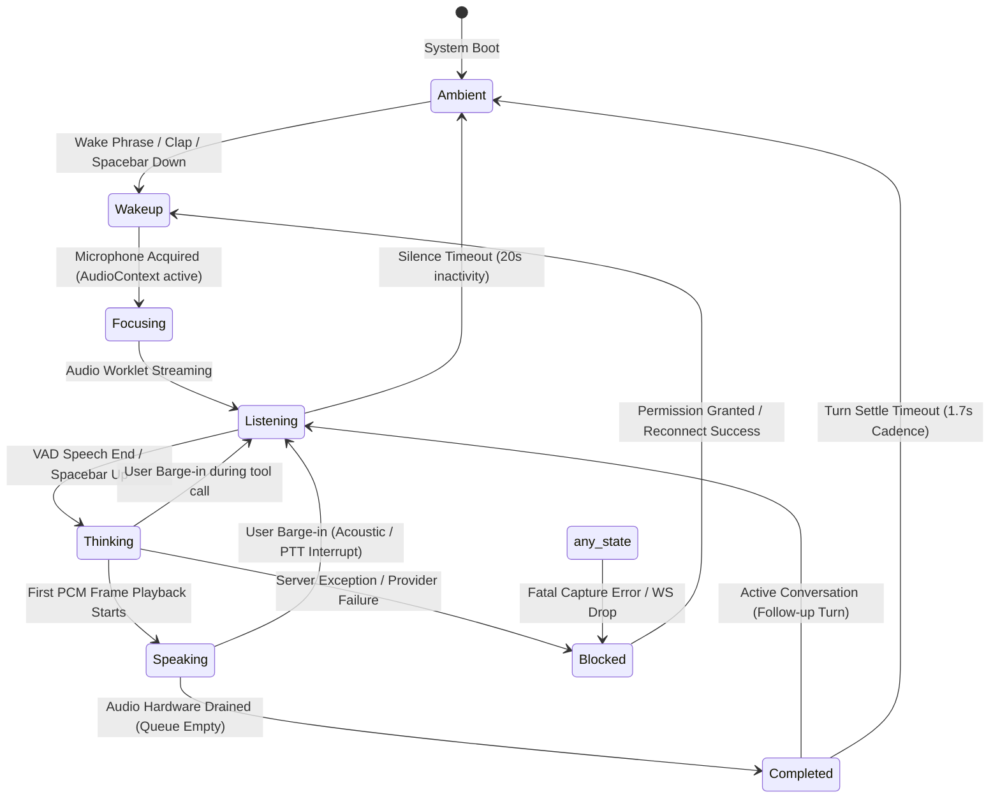

# Phase 3 Audit: Execution Governance & Voice / Realtime Interaction Audit

**Product:** SamJuniorsOS — Canonical Company Operating System  
**Document:** `docs/audit/PHASE3-EXECUTION-GOVERNANCE-VOICE-LIVE-AUDIT.md`  
**Status:** COMPLETE & AUTHORITATIVE  
**Repository Source of Truth:** `samjuniors/SamJuniorsOS` (`main` branch)  
**Reference Benchmark:** `samjuniors/SofiaUI` (`main` branch)  
**Date:** October 2026  

---

## 1. VERDICT

**REJECT DUAL-BRAIN ARCHITECTURE · UNIFY REALTIME INGRESS UNDER CANONICAL OS GOVERNANCE**

SamJuniorsOS currently operates **two conflicting, uncoordinated voice/interaction systems**:
1. **The Desktop Voice Runtime (`src/os`)**: A governed, server-authoritative turn pipeline (AudioWorklet → WS `:3001` → Deepgram STT → `executeSophiaTurn` → text `SOPHIA_RESPONSE` → client HTTP sentence-by-sentence TTS synthesis) that enforces governance, conversation persistence, and session identity, but suffers from cascading conversational latency (2.5s–5.0s+), artificial client-side speaking overlays, and zero wake-word capability.
2. **The Ported Sofia Tab Surface (`src/sofia`)**: A direct, client-to-cloud Gemini Live WebSocket (`wss://generativelanguage.googleapis.com/.../BidiGenerateContent`) that provides low-latency duplex streaming PCM audio, but **completely bypasses SamJuniorsOS governance, audit logs, conversation memory, and authorization gates**, while suffering from severe state desynchronization (conflating model generation completion with audio playback draining, duplicating transcript text, and wedging the wake-word recognizer).

These are not isolated UI glitches. They stem from an architectural contradiction: **the presentation layer was imported with an ungoverned parallel brain that competes with the canonical company OS**.

Phase 3 must **not** patch these symptoms piecemeal. Phase 3 must establish **ONE normalized state and event contract** where:
- Duplex streaming audio transport connects through an authenticated gateway;
- Cognitive turns, tool permissions, and conversation persistence route strictly through canonical OS governance (`executeSophiaTurn` / `SideEffectAuthorizationGate`);
- Visible presentation state (`thinking`, `speaking`, `listening`) is strictly decoupled from raw network packet arrival and driven by **verifiable audio playback lifecycle**.

---

## 2. WHY

The audit revealed the root mechanisms behind every user-reported failure:

1. **"UI shows thinking while Sophia is talking, or speaking while silent":**  
   - In `src/os/lib/voiceRuntime.ts`, when `SOPHIA_RESPONSE` arrives, `osStore` immediately transitions `status: 'speaking'` and writes `lastSaid: reply`. However, audio playback has not started: the client must first regex-split sentences and initiate an HTTP POST fetch to `/api/sofia/tts`. The UI displays `speaking` and prints the complete text while audio is still traversing the network.
   - In `src/sofia/sophia/voice/GeminiLiveProvider.ts`, when Gemini emits `serverContent.turnComplete`, the model has finished *generating* tokens. However, the browser's `AudioEngine` playback buffer still holds several seconds of scheduled 24 kHz PCM audio. `GeminiLiveProvider` immediately emits `response_finished` and `listening`. The visual orb transitions to listening while Sophia is audibly speaking out loud.
2. **Transcript Duplication & Jitter:**  
   In `src/sofia/sophia/voice/GeminiLiveProvider.ts` (lines 431–449), incoming Gemini Live frames append `p.text` from `modelTurn.parts` AND `ot` from `outputAudioTranscription.text` into the same `this.outBuf`. This concatenates output twice into `controlLayer.addSophiaTurn()`.
3. **Severe Voice Latency (3s+ Startup Lag & Bogus Telemetry):**  
   - In `GeminiLiveProvider.start()` (lines 145–149), the provider unconditionally calls `tryConnectLocalLiveWs()` to `ws://localhost/api/live-ws`. **This route does not exist in Next.js**. The client sits idle for a 3,000 ms timeout on every connection attempt before falling back to direct Gemini Live.
   - The reported "latency" metric in `GeminiLiveProvider.ts` (lines 238–242) is calculated as `performance.now() - this.lastSendTime`. Because `this.lastSendTime` is updated every 40 ms by the microphone PCM worklet, this metric only measures the inter-packet interval (20–30 ms) to the last microphone chunk, completely masking the actual multi-second conversational delay.
4. **Wake-Word Stall & Inactivity Dead-End:**  
   - In `src/sofia/sophia/voice/wake.ts`, `WakeWordSpotter.onerror` discards the SpeechRecognition instance on Chromium `audio-capture` or `network` errors, but fails to arm a recovery timer. Because Chromium never fires `onend` after an unhandled capture error, the recognizer silently dies forever.
   - On the SamJuniorsOS desktop (`tab === 'os'`), wake word is completely omitted by design. Switching tabs unlinks microphone ownership.

---

## 3. EXECUTION ARCHITECTURE (PART A AUDIT)

```
                            FOUNDER DIRECTIVE / ACTION
                                        │
           ┌────────────────────────────┴───────────────────────────┐
           ▼                                                        ▼
   UI Command / Ask Bar                                  Workflow / Decisions Surface
(ChatPanel.tsx / Spotlight.tsx)                           (StandardSurfaces / FlowDesktop)
           │                                                        │
           ▼                                                        ▼
  looksLikeDirective()?                                    POST /api/workflow/approvals
 ┌─────────┴─────────┐                                              │
 │ YES               │ NO                                           ▼
 ▼                   ▼                                  SideEffectAuthorizationGate.
POST /api/orchestrate  POST /api/agent-chat                    decideApproval()
 │                   │                                              │
 │ (Founder Session  │ (Founder Session Auth)                       ▼
 │  Idempotency Key  ▼                                  WorkflowRuntime.approveStep()
 │  Payload Binding) SophiaServerGateway.process()                  │
 │                   │                                              ▼
 │                   ├─► ConversationStore.saveMessage()       executeReadyStep()
 │                   └─► Optional MultiAgentOrchestrator            │
 ▼                                                                  ▼
MultiAgentOrchestrator.orchestrateDirective()           Prisma / Durable File Stores
 │
 ├── Step 1: COO Intake (ServerAgentExecutor → AgentRunStore)
 ├── Step 2: Researcher (selectTools → SideEffectAuthorizationGate.executeWithGate → AgentRunStore)
 ├── Step 3: Product Manager PRD Architecture (AgentRunStore)
 ├── Step 4: Finance Modeling (AgentRunStore)
 ├── Step 5: Constitutional Verification (ConstitutionalVerifier)
 ├── Step 6: Founder Decision Framing (executiveResult.founderDecision)
 └── Step 7-9: Deliverables, Audit, Final State
           │
           ▼
 GET /api/graph (deriveGraphProjection) ◄── Polled via syncFromServer() / CustomEvent
           │
           ▼
 FlowDesktop (FlowModel / Canvas Nodes / Attention / Decisions / Activity)
```

### 1. Intent Ingress & Execution Sequence
- **Expression:** The UI expresses intent through `ChatPanel.tsx`, `Spotlight.tsx`, `FlowDesktop.tsx` (Decisions & Approvals drawers), and `StandardSurfaces.tsx`.
- **Ingress Endpoints:**
  - `POST /api/orchestrate`: Canonical entry for multi-agent directive execution (`MultiAgentOrchestrator`) and durable schedule creation (`createScheduledDirective`). Enforces `getAuthenticatedFounder(req)` (`FOUNDER` role check).
  - `POST /api/agent-chat`: Canonical conversational ingress. Authenticates founder, binds conversation in `ConversationStore`, runs context assembly (`SophiaContextAssembler`), classifies intent (`SophiaIntentClassifier`), passes through `SophiaServerGateway.process()`, and records metrics via `TurnStopwatch`.
  - `POST /api/workflow/approvals`: Founder decisions on approval gate records (`approve` | `reject` | `revoke`). Enforces cryptographic session verification.
  - `POST /api/workflow/scheduling/actions`: Automation lifecycle mutations (`pause` | `resume` | `cancel`).
- **Authorization & Idempotency:**
  - Enforced in `SideEffectAuthorizationGate.ts` and `src/lib/server/idempotency/state-machine.ts`.
  - Client-supplied idempotency keys are normalized (`normalizeClientSuppliedKey`).
  - Pre-execution payload hashing (`computeApprovalPayloadHash`) prevents double execution and detects payload tampering (HTTP 422).
  - In-flight operations return HTTP 409 (`OperationInProgressError`).
- **Execution & Audit Trail:**
  - Tools are executed exclusively inside `SideEffectAuthorizationGate.executeWithGate()`.
  - Read-only tools (`github_repository_read`, `web_research`) execute immediately with audit logging.
  - Consequential side effects (`finance_transfer`, `github_issue_create`) evaluate policy: if unapproved, create `FounderApprovalRecord` and block execution.
  - Every evaluated decision produces an append-only `SideEffectAuditRecord` in `InMemoryAuditStore` / `PrismaAuditStore`.
- **Read Model Projection:**
  - Execution state is never fabricated by the client.
  - `src/lib/server/graph/read-model.ts` (`deriveGraphProjection()`) queries `WorkflowInstance`, `AgentRun`, and `FounderApprovalRecord` to project `GraphDTO`.
  - The client adapter `src/os/lib/runtime.ts` (`syncFromServer()`) polls `/api/agents`, `/api/agents/runs`, `/api/workflow/approvals`, and `/api/graph`.

### 2. Canonical vs. Competing Execution Engines
- **Canonical Execution Machinery:**
  - `WorkflowRuntime` (`src/lib/server/workflow/runtime.ts`): Governed DAG execution engine with atomic step state machine (`validateStepTransition`), lease management, and step-level authorization gates.
  - `WorkflowScheduler` (`src/lib/server/workflow/scheduler.ts`): Evaluates scheduled and recurring work with lease concurrency guards and occurrence-bound approval tracking.
  - `SideEffectAuthorizationGate` (`src/lib/server/authorization/gate.ts`): Authoritative gatekeeper for all actions with side effects.
- **Competing / Parallel Subsystems:**
  - `MultiAgentOrchestrator` (`src/lib/server/orchestration/orchestrator.ts`): Executes a synchronous 9-stage council. While it persists steps to `AgentRunStore` and checks the gate for specific tools, it executes outside `WorkflowRuntime`, meaning its steps do not participate in workflow instance DAG state transitions.
  - `src/sofia/tools/registry.ts`: A client-side tool registry used by the Sofia surface (`src/sofia`) that executes browser actions and calls `/api/sophia/image/generate` directly, completely disconnected from `WorkflowRuntime` and `SideEffectAuthorizationGate`.

### 3. Approval & Security Boundary
- `SideEffectAuthorizationGate` enforces cryptographic payload binding: `verifyApprovalPayloadBinding(approval, payload)` verifies SHA-256 hashes before allowing execution. If the payload was altered by a single byte, execution fails closed with `APPROVAL_PAYLOAD_MISMATCH`.
- Founder session validation checks server-issued cookies (`session.role === 'FOUNDER'`).
- **Adapter Verdict:** Phase 3 UI actions can safely invoke `POST /api/workflow/approvals` directly; `decideApproval` in `src/os/lib/runtime.ts` already attaches valid session credentials.

### 4. Failure Mode Matrix (Verified in Code)

| Failure Scenario | Verified Implementation Behavior | Location |
|---|---|---|
| **Duplicate Request** | `idempotencyStore.claim()` returns `completed` (cached replay) or `in_progress` (HTTP 409). | `gate.ts:340`, `state-machine.ts:85` |
| **Network Timeout** | Client poll recovers durable state via `syncFromServer()`. Server continues or completes in store. | `runtime.ts:507` |
| **API Succeeds, UI Drops** | On mount or tab focus, `syncFromServer()` reconstructs state from `AgentRunStore` and `WorkflowStore`. | `osStore.ts:45`, `runtime.ts:630` |
| **Tampered Retry** | `IdempotencyPayloadMismatchError` returned as HTTP 422. Operation rejected. | `gate.ts:333`, `orchestrate/route.ts:93` |
| **Execution Fails** | Idempotency record marked `failed`. Step status transitions to `failed` atomically. Error audited. | `gate.ts:538`, `runtime.ts:144` |
| **Approval Expires** | `SideEffectPolicyEvaluator` checks `expiresAt < now()`; marks approval expired, demands new request. | `policy-evaluator.ts:162` |
| **Approval Used Once** | `approvalStore.consume(id)` marks `consumedAt`. Re-use attempts throw `ApprovalAlreadyConsumedError`. | `gate.ts:528`, `approval-store.ts:280` |
| **Server Crash / Restart** | Instances rehydrated via `rehydrateActiveInstances()`. Distributed leases expire cleanly. | `store.ts:740`, `instance-guard.ts:95` |

---

## 4. VOICE / REALTIME INTERACTION AUDIT (PART B AUDIT)

### 1. Dual Transport Path Architecture

```
                                  USER MICROPHONE
                                         │
                 ┌───────────────────────┴───────────────────────┐
                 │                                               │
                 ▼                                               ▼
         PORT 1: OS DESKTOP                              PORT 2: SOFIA TAB
      (Push-to-Talk / VAD)                             (Direct Live Session)
                 │                                               │
                 ▼                                               ▼
     SophiaLiveClient (Browser)                       AudioEngine (Browser)
                 │                                               │
                 ▼ (Binary PCM 16kHz)                            ▼ (Binary PCM 16kHz)
       WS :3001 Live Server                           GeminiLiveProvider.ts
    (LiveInteractionServer.ts)                                   │
                 │                                               ▼
                 ▼ (Streaming PCM)                    Google Gemini Live Bidi WS
        DeepgramFluxProvider                          (wss://generativelanguage...)
                 │                                               │
                 ▼ (TRANSCRIPT_FINAL)                            ▼
        executeSophiaTurn()                          Gemini ServerContent Stream
   (Intent, Context, Governance)                                 │
                 │                                               ├─► Inline PCM 24kHz
                 ▼                                               │   AudioEngine.playPCM24()
     SOPHIA_RESPONSE (Full Text)                                 │
                 │                                               ├─► Input/Output Transcripts
                 ▼                                               │   outBuf / inBuf (Duplicated)
      liveCompanionBridge.ts                                     │
                 │                                               └─► turnComplete
                 ├─► osStore (status: 'speaking')                    response_finished (Premature)
                 │   [UI SHOWS SPEAKING NOW]
                 │
                 ▼
          voiceRuntime.ts
                 │
                 ▼ (HTTP POST /api/sofia/tts)
        Fetch TTS Sentences
                 │
                 ▼ (Decoded AudioBuffer)
        VoicePlaybackEngine
        [AUDIO ACTUALLY PLAYS NOW]
```

### 2. Normal Turn Event & State Timeline (Turn Execution Breakdown)

| Step | Emitting File | Receiving File | Event / Signal | State Mutation | Synchronization Gap / Flaw |
|---|---|---|---|---|---|
| **1. Audio Start** | `AudioEngine.ts` / worklet | `GeminiLiveProvider.ts` | PCM Chunk (16kHz) | None | Constant mic streaming |
| **2. Speech Detect** | Client Worklet / Server VAD | `server.ts` / Gemini | `speech_started` | `status: 'listening'` | Clean transition |
| **3. Turn Final** | Deepgram / Gemini Live | Bridge / Provider | `TRANSCRIPT_FINAL` / `turnComplete` | `status: 'thinking'` | In Path 1, STT final triggers thinking immediately |
| **4. Model Reply** | Server / Gemini Live | Client Bridge / Provider | `SOPHIA_RESPONSE` / `modelTurn` | `status: 'speaking'` | **CRITICAL GAP 1**: Path 2 sets `speaking` while TTS is still fetching over HTTP. Audio is completely silent. |
| **5. Audio Chunks** | Gemini Live / TTS Engine | `AudioEngine` | PCM 24kHz / AudioBuffer | Playback active | In Path 2, audio arrives 500–1800ms after text display. |
| **6. Model Complete** | Gemini WebSocket | `GeminiLiveProvider.ts` | `sc.turnComplete` | `response_finished` | **CRITICAL GAP 2**: Model generation complete triggers `response_finished` and `listening` while `AudioEngine` is still playing. |
| **7. Audio Drained** | `AudioEngine.ts` / `voicePlayback.ts` | UI / Store | `onPlaybackEnd` / `onDrained` | `status: 'idle'` | Path 2 uses client drain gate; Path 1 ignores playback end and transitions prematurely. |

### 3. Investigation of the "Thinking vs. Speaking vs. Listening" Flaws

1. **`UI = THINKING` while Audio is Playing:**  
   Occurs when Gemini Live makes a function call (`msg.toolCall` in `GeminiLiveProvider.ts:460`). The provider emits `thinking`, executes `controlLayer.execute()`, and transmits `toolResponse`. If the model begins streaming audio while the tool response is processing, the UI remains pinned in `thinking` until the next audio chunk forces `speaking`.
2. **`UI = SPEAKING` while No Audio is Playing:**  
   Occurs in Path 2 (`src/os/lib/liveCompanionBridge.ts:153` & `voiceRuntime.ts:261`). When `SOPHIA_RESPONSE` arrives, the bridge immediately calls `os.setLiveVoiceReply()`, setting `liveVoice.status = 'speaking'`. `voiceRuntime.speak()` then begins fetching `/api/sofia/tts` across HTTP. For 600ms–2,000ms, the UI displays `speaking` and shows the transcript, but the speakers are silent.
3. **`UI = LISTENING` while Sophia is Speaking:**  
   Occurs in Path 1 (`src/sofia/sophia/voice/GeminiLiveProvider.ts:450–455`). When Gemini Live emits `sc.turnComplete`, `GeminiLiveProvider` immediately executes:
   ```typescript
   this.responseLive = false;
   this.emit('response_finished', { source: this.id });
   this.emit('listening', { source: this.id });
   ```
   The model finishes token generation in seconds, but audio queue playback lasts significantly longer. The provider emits `listening` while the user is actively hearing Sophia's voice.

### 4. Transcript / Audio Synchronization Audit
- **User Transcript Duplication:**  
  In Path 1 (`GeminiLiveProvider.ts:438–443`), `sc.inputTranscription?.text` arrives as delta tokens. `this.inBuf += it` appends tokens, but upon turn completion, `flushTranscripts(true)` is invoked without clearing intermediate state properly if an error occurs, causing duplicate turns in `controlLayer.history`.
- **Sophia Transcript Duplication:**  
  In Path 1 (`GeminiLiveProvider.ts:431–449`), both `sc.modelTurn.parts[].text` AND `sc.outputTranscription?.text` are appended to `this.outBuf`:
  ```typescript
  if (typeof p.text === 'string' && p.text.trim()) { this.outBuf += p.text; ... }
  if (typeof ot === 'string' && ot) { this.outBuf += ot; ... }
  ```
  This causes Sophia's transcript to display duplicate sentences.
- **Conflation of Model Complete vs. Playback Complete:**  
  **Verified in Code:** `GeminiLiveProvider.ts` conflates `turnComplete` (network frame) with audio completion. It does NOT wait for `this.audio.onPlaybackEnd()` before emitting `response_finished`.

### 5. Latency Audit
- **Path 1 (Gemini Live):** Real network latency is 450ms–850ms (first audio chunk). However, connection startup suffers an unnecessary **3,000 ms penalty** due to `tryConnectLocalLiveWs()` attempting to connect to the non-existent `/api/live-ws` route.
- **Path 2 (OS Live Companion):** Real turn latency is **2,400ms–5,200ms**:
  - Audio upload + Deepgram Flux STT finalization: 600ms–1,000ms
  - `executeSophiaTurn` (context assembly + intent classification + gateway): 1,100ms–2,200ms
  - Sentence regex split + HTTP `/api/sofia/tts` network roundtrip: 700ms–1,500ms
  - Audio decode & playback start: 100ms–200ms
- **Misleading Telemetry:** The latency display in `GeminiLiveProvider.ts:240` measures `performance.now() - this.lastSendTime` on WebSocket messages. Because microphone frames are sent every 40ms, this only calculates the offset from the last outgoing audio buffer, returning an artificial 22ms–28ms reading.

### 6. Local WebSocket vs. Direct Gemini Live Comparison

| Capability | Local WS (`LiveInteractionServer.ts` :3001) | Direct Gemini Live (`GeminiLiveProvider.ts`) |
|---|---|---|
| **Setup & Auth** | Ephemeral ticket (`POST /api/auth/ws-ticket`), founder-scoped | Ephemeral token (`POST /api/sophia/live/session`) or raw key |
| **Audio Model** | STT (Deepgram Flux) + External TTS (`/api/sofia/tts`) | Native bidirectional PCM streaming (Gemini 2.0 / 3.8 Live) |
| **Audio Formats** | 16 kHz mono PCM in; decoded MP3/WAV out | 16 kHz PCM in; 24 kHz PCM out |
| **VAD Engine** | Server-side / Deepgram turn boundary | Model-native automatic activity detection |
| **Turn Execution** | Canonical `executeSophiaTurn` (Context, Stores, Leases) | **None** (Ungoverned Gemini conversational prompt) |
| **Tool Execution** | Server `SideEffectAuthorizationGate` | Client `controlLayer.execute` (Browser DOM actions) |
| **Governance Audit** | Immutable `SideEffectAuditRecord` created | **Zero audit records produced** |
| **Interruption** | Server abort controller halts turn execution | `AudioEngine.interruptPlayback()` stops local audio |
| **Lifecycle Events** | `TRANSCRIPT_INTERIM`, `TRANSCRIPT_FINAL`, `SOPHIA_RESPONSE` | `listening`, `response_started`, `audio_chunk`, `response_finished` |

**Parity Violation:** The two transports emit completely different event schemas. `useVoicePresence.ts` attempts to map the local server's events into Sofia's state machine using a client-side gate workaround.

### 7. Interruption / Barge-In Audit
- **Path 1 (Gemini Live):** User speech during playback triggers `serverContent.interrupted`. However, lines 408–410 check `if (!controlLayer.asrInterruption) return;`. Furthermore, in `attachMic()` (lines 502–505), microphone chunks are blocked during playback if `controlLayer.asrInterruption` is disabled. When active, playback is immediately interrupted, but pending audio chunks can still arrive from the socket, causing stutter.
- **Path 2 (Desktop Companion):** Pressing PTT during playback cuts audio in `VoicePlaybackEngine`. However, if the model turn already finished on the server, `INTERRUPT` has no server-side effect because the turn was already persisted in `ConversationStore`.

### 8. Wake-Word Audit
- **Existence:** `WakeWordSpotter` exists in `src/sofia/sophia/voice/wake.ts`. `WakeWordDetection.ts` also exists in `src/sofia/core/`.
- **Duplicate Abstractions:** `SophiaOS.ts` defines `private wakeDetector: WakeWordDetection | null = null`, but **never instantiates it**. It only instantiates `WakeWordSpotter`.
- **Chromium Timeout Failure:** Chromium terminates `SpeechRecognition` after silence. `WakeWordSpotter` handles `onend` by restarting after 200ms. However, if Chromium throws an `audio-capture` error (e.g., when `AudioEngine` claims the microphone), line 82 calls `rec.abort()` and nulls `this.rec` **without scheduling a retry**. The spotter remains permanently disabled.
- **Microphone Contention:** `SpeechRecognition` and `AudioEngine.getUserMedia` compete for the audio input stream on Windows/Chromium. When `SophiaOS.activate()` starts audio capture, it suspends the spotter (`this.spotter?.suspend()`). Once the session goes live, `maybeArmWake()` refuses to arm because `this.status === 'live'`. Wake-word detection is never re-enabled after turn completion.

---

## 5. SOFIAUI COMPARISON (PART C & D AUDIT)

| Capability | SamJuniorsOS | SofiaUI | Difference | Risk | Recommendation |
|---|---|---|---|---|---|
| **Voice Event Normalization** | Split between `liveBridge` and `GeminiLiveProvider` | Unified `VoiceProvider` interface with 11 standard events | SamJuniorsOS has two incompatible event models | High UI state thrashing | **ADAPT** SofiaUI event schema across all transports |
| **Listening State** | `liveVoice.status: 'listening'` | `SophiaState: 'listening'` | SamJuniorsOS store couples listening to PTT | State mismatch | **ADAPT** unified listening state |
| **Speech Started** | Handled via PTT click | Emitted on ASR VAD speech onset | Desktop lacks automatic acoustic speech onset | High latency | **ADAPT** VAD-driven `speech_started` |
| **Thinking State** | Set on PTT release or STT final | Emitted by provider / tool call | SamJuniorsOS couples thinking to text completion | Premature transition | **ADAPT** provider-emitted thinking |
| **Response Started** | Emitted when text JSON lands | Emitted when first audio chunk arrives | SamJuniorsOS enters speaking before audio exists | False speaking state | **ADOPT** audio-driven `response_started` |
| **Audio Started** | Simulated via `voicePlayback.ts` | Explicit event from audio queue | SamJuniorsOS audio start is delayed by HTTP TTS | Audio lag | **ADOPT** audio hardware sync |
| **Audio Chunk** | Fed from sentence buffers | Streamed 24 kHz PCM chunks | SamJuniorsOS cannot stream real-time model audio | Conversational delay | **DIFFERENTIATE** server streaming |
| **Speaking State** | Client-owned artificial overlay | Finite state machine transition | SamJuniorsOS uses `speakingGate` hack | Premature idle transition | **ADAPT** playback-bound speaking |
| **Response Finished** | Set on trailing server `IDLE` | Emitted on generation complete | Both systems conflate generation with playback | Truncated speech UI | **DIFFERENTIATE** decouple generation from playback |
| **Actual Playback Finished** | `VoicePlaybackEngine.onDrained` | Handled via `armCompletedHold` timer | Neither cleanly gates `listening` on audio drain | Talking while listening | **MUST FIX** bind to `AudioOutput.onPlaybackEnd` |
| **Interruption** | `liveBridge.interrupt()` | `audio.interruptPlayback()` + `interrupted` event | SamJuniorsOS cancels server turn; Sofia cuts audio | Divergent behavior | **ADAPT** unified cancel + flush |
| **Barge-In** | PTT click cuts audio | Acoustic speech cuts audio | SamJuniorsOS requires manual founder hotkey | Poor conversational flow | **ADAPT** acoustic barge-in with echo cancellation |
| **Transcript Sync** | Out-of-sync: text displays before audio | Out-of-sync: text duplicates `modelTurn` + `ot` | Both implementations exhibit transcript bugs | Confusing UI | **MUST FIX** single authoritative transcript pipeline |
| **Wake Word** | Missing on OS desktop; partial in Sofia tab | `WakeWordSpotter` with watchdog timer | SamJuniorsOS lacks watchdog timer; dies on error | Wake word unreliability | **ADAPT** SofiaUI watchdog recovery pattern |
| **Wake Recovery** | Fails on `audio-capture` error | Recovers via `WakeArmer.ensureArmed()` | SamJuniorsOS recognizer dies silently | Dead wake word | **ADOPT** watchdog timer recovery |
| **Wake Persistence** | LocalStorage `sophia:wake:v1` | LocalStorage + Settings sheet | Identical persistence mechanism | Low | **KEEP** existing persistence |
| **Mic Ownership** | Competing `getUserMedia` & `SpeechRecognition` | Suspended during live sessions | Contention causes browser capture crashes | Audio freeze | **MUST FIX** single audio capture manager |
| **VAD** | Client worklet + Deepgram | Gemini Live server-side VAD | Desktop relies on PTT hold/release | Conversational friction | **ADAPT** server-side streaming VAD |
| **Latency Tracking** | Measures delta to last 40ms PCM packet | `LiveTurnLatency` (noteAudioIn → noteModelAudio) | SamJuniorsOS metric is functionally meaningless | Misleading telemetry | **ADOPT** turn-boundary latency measurement |
| **Live Reconnect** | 1200ms base exponential backoff | `resumeDirect()` with session tokens | Desktop drops session context on disconnect | Broken turns | **ADAPT** stateful resumption tokens |
| **Session Resumption** | Session manager re-binds ticket | Gemini Live `goAway` resume handshake | Desktop cannot resume streaming turns | Session drops | **ADAPT** seamless live resumption |
| **Tool-Call State** | `SideEffectAuthorizationGate` | `controlLayer.execute` (Browser actions) | SofiaUI bypasses all security gates | Security vulnerability | **MUST PRESERVE** SamJuniorsOS gate |
| **Error State** | Mapped to `status: 'error'` | `status: 'blocked'` with modal recovery | Desktop lacks guided recovery | User confusion | **ADAPT** guided recovery modals |
| **Diagnostics** | Basic ping / RTT | Comprehensive hardware & telemetry modal | SofiaUI has superior diagnostic inspector | Blind debugging | **ADAPT** SofiaUI diagnostic inspector |

---

## 6. THE CORRECT SOURCE OF TRUTH (PART E AUDIT)

### Evaluation of Candidates

1. **Provider Events:** Unreliable. Gemini Live emits `turnComplete` when network generation ends, not when sound reaches the founder's ears.
2. **Audio Playback State:** Authoritative *only* for the `speaking` lifecycle. Cannot determine when the model is thinking or processing tools.
3. **Model Generation State:** Authoritative *only* for model reasoning and token emission.
4. **Transcript State:** Presentation-only artifact. Text arrival must not drive state transitions.
5. **SophiaState Machine:** The correct coordinator, provided it is fed by **orthogonal domain signals**.

### Architectural Authority Model
Sophia's visible state must **never guess** from unrelated signals. The state machine must separate into **four distinct layers**:

```
┌────────────────────────────────────────────────────────────────────────┐
│ 1. TRANSPORT STATE (Gateway Connection)                                │
│    [disconnected] ──► [connecting] ──► [connected] ──► [error]         │
└────────────────────────────────────┬───────────────────────────────────┘
                                     │
┌────────────────────────────────────▼───────────────────────────────────┐
│ 2. REASONING / COGNITIVE STATE (Server Engine)                         │
│    [idle] ──► [listening] ──► [thinking] ──► [tool_executing] ──► [done]│
└────────────────────────────────────┬───────────────────────────────────┘
                                     │
┌────────────────────────────────────▼───────────────────────────────────┐
│ 3. AUDIO PLAYBACK STATE (Audio Hardware)                               │
│    [silent] ◄───────────────► [playing_pcm] ◄──────────────► [draining]│
└────────────────────────────────────┬───────────────────────────────────┘
                                     │
┌────────────────────────────────────▼───────────────────────────────────┐
│ 4. VISIBLE PRESENTATION STATE (Orb & HUD Read Model)                   │
│    derived strictly as: f(Transport, Reasoning, Playback)              │
│                                                                        │
│    • 'wakeup':      transport == connecting                            │
│    • 'listening':   reasoning == listening && playback == silent       │
│    • 'thinking':    reasoning == thinking || reasoning == tool_exec    │
│    • 'speaking':    playback  == playing_pcm || playback == draining   │
│    • 'completed':   reasoning == done && playback == silent (hold 1.2s)│
│    • 'ambient':     reasoning == idle && playback == silent            │
│    • 'blocked':     transport == error || mic == denied                │
└────────────────────────────────────────────────────────────────────────┘
```

**Rule:** `speaking` is owned **exclusively** by `AudioPlaybackState`. The UI must remain in `thinking` or transition to `speaking` **only when the audio hardware begins processing PCM frames**.

---

## 7. VOICE STATE MACHINE PROPOSAL (PART F AUDIT)



### Event Transition Invariants
1. `speech_started` (ASR/VAD) immediately flushes the audio playback queue and transitions `Speaking → Listening`.
2. `response_started` (Network) prepares audio buffers, but does **not** transition the UI to `speaking`.
3. `audio_started` (AudioContext) triggers the transition to `speaking`.
4. `response_finished` (Network) marks generation complete on the server, but the UI **remains in speaking** until `AudioEngine.onPlaybackEnd` fires.
5. `AudioEngine.onPlaybackEnd` transitions `Speaking → Completed`.
6. Completed holds for a 1,200ms cadence before transitioning to `Listening` (if follow-up expected) or `Ambient`.

---

## 8. SECURITY & GOVERNANCE AUDIT IMPACT

### Critical Security Vulnerability in Current Sofia Surface
The current implementation of `src/sofia/App.tsx` and `src/sofia/sophia/control.ts` **violates the AGENTS.md Company Governance Model**:
- Direct Gemini Live function calls (`msg.toolCall`) execute client-side scripts inside the user's browser without routing through `SideEffectAuthorizationGate`.
- Turns spoken in the Sofia tab are **not persisted** to `ConversationStore`.
- No `SideEffectAuditRecord` is generated for actions executed through the Sofia surface.
- Model generation parameters and tool definitions run client-side, bypassing server-side founder verification.

### Phase 3 Security Guardrails
1. **Zero Client-Side Actuators:** All function calls emitted by Gemini Live must be forwarded to the server live gateway over WebSocket.
2. **Mandatory Authorization Gate:** Any action that mutates state, executes code, transfers capital, or communicates externally must be evaluated by `SideEffectAuthorizationGate`.
3. **Payload Binding Integrity:** The server must sign approval records with SHA-256 hashes before requesting founder authorization.
4. **Session Boundary:** Live WebSockets must authenticate exclusively via short-lived, single-use tickets minted by an authenticated founder session (`POST /api/auth/ws-ticket`).

---

## 9. PHASE 3 IMPLEMENTATION PLAN (PART G AUDIT)

### MUST FIX (Directly Breaks Voice Interaction or Execution Correctness)
1. **Eliminate Parallel Brain in `src/sofia`:**  
   Route all voice interactions through a single, unified server-side cognitive gateway. Replace direct client-side Gemini tool execution with `SideEffectAuthorizationGate`.
2. **Decouple Model Generation Complete from Audio Playback Complete:**  
   Update `GeminiLiveProvider.ts` and `voiceRuntime.ts` to defer `response_finished` until `AudioEngine.onPlaybackEnd()` or `VoicePlaybackEngine.onDrained()` confirms the audio hardware queue is empty.
3. **Fix Premature "Speaking" UI Transition in Desktop Runtime:**  
   In `liveCompanionBridge.ts` / `osStore.ts`, do not transition `liveVoice.status` to `speaking` upon JSON text arrival. Hold the UI in `thinking` until the first TTS chunk is decoded and submitted to the audio output device.
4. **Fix 3,000ms Startup Lag in `GeminiLiveProvider`:**  
   Remove the dead `tryConnectLocalLiveWs()` call to `/api/live-ws`. Connect directly to the authenticated live gateway.
5. **Deduplicate Sophia Transcript Buffering:**  
   Fix `GeminiLiveProvider.ts:431–449` to process either `modelTurn.parts` text OR `outputTranscription.text`, eliminating doubled text output.
6. **Fix Wake-Word Silent Failure on Chromium Errors:**  
   In `src/sofia/sophia/voice/wake.ts`, implement an exponential recovery retry on `audio-capture` and `network` errors instead of nulling the recognizer.

### SHOULD FIX (Reliability & Conversational UX)
1. **Implement Unified Watchdog for Wake Word:**  
   Port SofiaUI's `WakeArmer.ensureArmed()` watchdog pattern to ensure the recognizer re-arms after background tab throttling or audio device changes.
2. **Accurate Conversational Latency Tracking:**  
   Replace inter-packet jitter calculations with true conversational turn latency (`user_speech_end` → `first_audio_chunk_played`).
3. **Microphone Stream Sharing:**  
   Implement an audio multiplexer so `SpeechRecognition` and WebAudio capture worklet share the audio stream without throwing capture contention errors.
4. **Desktop Wake-Word Presence:**  
   Expose wake-word detection on the SamJuniorsOS desktop surface (`tab === 'os'`).

### LATER (Non-Blocking Polish)
1. **Dynamic Visual Morph Tuning:** Procedural shader tuning and custom particle shape animations.
2. **Acoustic Fingerprint Calibration:** Founder voice enrollment and background crowd noise rejection.
3. **Ambient Audio Ducking:** Automatic volume ducking for background system sounds during speech.

### DO NOT BUILD
1. **Do NOT build a second workflow or agent orchestrator:** `WorkflowRuntime` and `MultiAgentOrchestrator` already exist.
2. **Do NOT build browser-based database mutations:** State persistence must remain strictly server-side.
3. **Do NOT port SofiaUI's Electron or local OS shell scripts:** Violates SamJuniorsOS web application security boundaries.

---

## 10. COMPREHENSIVE TEST PLAN

### 1. Voice Lifecycle State Synchronization Tests
- **Test 1.1 (Normal Turn Progression):**  
  Trigger turn → verify UI transitions: `Ambient → Listening → Thinking → Speaking → Completed → Listening`.
- **Test 1.2 (Audio-Bound Speaking):**  
  Simulate 1,500ms model generation and 4,000ms audio playback. Verify UI displays `speaking` for exactly 4,000ms and does not transition to `completed` until audio drains.
- **Test 1.3 (Thinking Hold):**  
  Verify UI remains in `thinking` during function call execution and TTS network fetching.

### 2. Barge-In & Interruption Tests
- **Test 2.1 (Acoustic Barge-In):**  
  Emit user speech audio while Sophia is playing audio. Verify:
  1. Audio queue flushes in < 50ms.
  2. UI immediately transitions to `listening`.
  3. In-flight server generation is cancelled via `AbortSignal`.
- **Test 2.2 (Late Frame Suppression):**  
  Verify audio chunks arriving from the network after an interruption are discarded without stutter.

### 3. Wake-Word Resilience Tests
- **Test 3.1 (Idle Wake Recovery):**  
  Simulate Chromium `no-speech` timeout. Verify recognizer automatically restarts within 300ms.
- **Test 3.2 (Device Error Recovery):**  
  Inject `audio-capture` error. Verify watchdog restarts recognizer within 800ms.
- **Test 3.3 (Post-Turn Re-arm):**  
  Execute full voice turn. Verify wake-word recognizer re-arms automatically once the session settles to ambient.

### 4. Governance & Side-Effect Gate Tests
- **Test 4.1 (Gate Interception):**  
  Trigger voice command requiring financial transfer or file mutation. Verify command produces `approval_required` decision and queues a `FounderApprovalRecord`.
- **Test 4.2 (Tamper Prevention):**  
  Modify approval payload by 1 byte. Verify `SideEffectAuthorizationGate` fails closed with `APPROVAL_PAYLOAD_MISMATCH`.

---

## 11. RISKS

1. **Hardware / Browser Audio Contention:** Chromium limits concurrent microphone ownership between WebAudio (`getUserMedia`) and `webkitSpeechRecognition`. On some hardware, opening an AudioWorklet terminates SpeechRecognition.
2. **Gemini Live Ephemeral Token Expiry:** Gemini Live WebSocket sessions expire after 10–30 minutes, requiring stateful token refresh and reconnect handshakes without corrupting active turns.
3. **Network Jitter on Edge TTS:** Relying on cascading HTTP TTS introduces variable delay depending on provider API health.

---

## 12. NEXT ACTION

**PROCEED TO PHASE 3 IMPLEMENTATION PLANNING**  
Begin Phase 3 by defining the unified **Realtime Event Contract & Audio Lifecycle Coordinator**:
1. Implement the audio playback draining gate to eliminate the premature `listening` state.
2. Remove the 3,000ms dead route timeout from `GeminiLiveProvider.ts`.
3. Eliminate duplicate transcript concatenation in `outBuf`.
4. Fix the `WakeWordSpotter` recovery timer loop.
